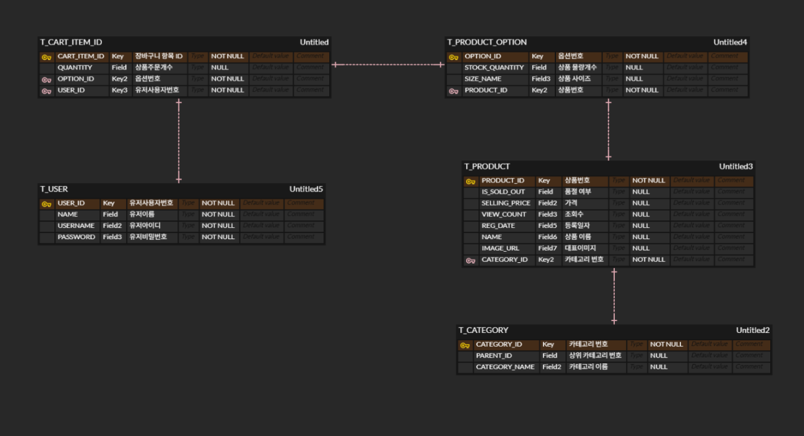

# 🛒 Showpping1 : 유한 옷 마켓 (Solo Project)
> **Spring Boot와 JPA를 활용한 재고 연동형 쇼핑몰 프로젝트**

 

## 📅 프로젝트 정보
- **제작 기간**: 2025.11.26 ~ 2025.12.3 (총 7일)
- **개발 인원**: 1인 개발 (기획, 설계, 프론트엔드, 백엔드)

 

## 🛠 Tech Stack

### Backend
   

### Frontend
    

 

## 📂 ERD Diagram
> **데이터베이스 설계 (상품, 옵션, 장바구니 간의 관계)**

 

## ✨ Key Features
- **상품 및 옵션 관리**: 카테고리별 상품 조회 및 사이즈별 상세 옵션(재고) 관리
- **장바구니 시스템**: 상품 옵션 선택 및 수량 변경 기능 구현
- **주문 및 재고 연동**:
  - 결제 시 구매 수량만큼 **DB 재고 자동 차감** 로직 구현
  - 결제 완료와 동시에 **장바구니 비우기** 연동
  - `@Transactional`을 통한 데이터 무결성 보장 및 예외 발생 시 롤백 처리

 

